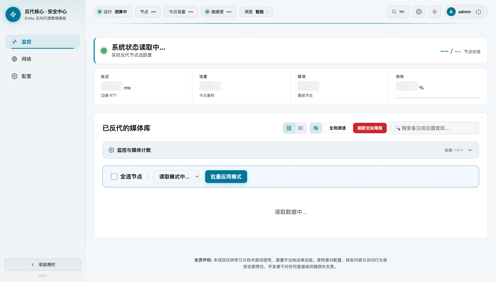
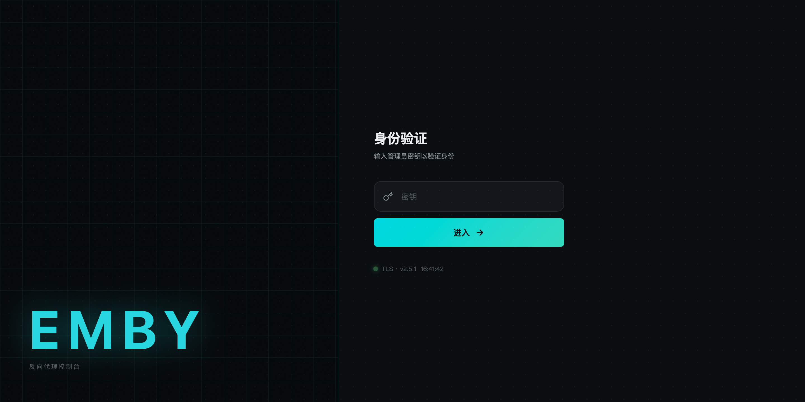

[中文](README.md) | **English**

# Emby Proxy

[](https://deploy.workers.cloudflare.com/?url=https://github.com/ykq007/emby-proxy)

A self-hosted, multi-node Emby reverse-proxy console that runs entirely on Cloudflare Workers.

## Screenshots

| Monitoring dashboard | Authentication |
| :---: | :---: |
|  |  |

## Features

- **Multi-node reverse proxy** — route requests to one or more upstream Emby servers, with node/route management from a web console.
- **DNS & optimized-domain management** — manage DNS records and CDN "optimized" (CF-friendly) domains for your Emby routes directly from the panel.
- **Keep-alive probing & alerts** — periodic health probes for every node, with Telegram alerts when a node goes offline.
- **Traffic & media stats** — bandwidth/traffic accounting and media (movie/show) count tracking per route.
- **Responsive web console** — a single admin panel (protected by `ADMIN_TOKEN`) for managing everything above.
- **Optional Telegram bot** — status queries, keep-alive checks, mute/unmute alerts, and node listing via bot commands.

## One-click deploy

1. Click **Deploy to Cloudflare** above.
2. Cloudflare forks this repo into your own GitHub account and connects it to Workers Builds.
3. Cloudflare auto-provisions a fresh **D1 database** and **R2 bucket** for your deployment (no manual resource setup).
4. You'll be prompted for environment variables — set at minimum `ADMIN_TOKEN` (required). CF_* and TG_* variables are optional and can be left blank.
5. Cloudflare builds (including obfuscation) and deploys the Worker automatically.

There is **no manual SQL or migration step** — the D1 schema self-migrates on first request (`ensureSchema()`).

## After deploy

1. Open your `*.workers.dev` URL.
2. Log in with the `ADMIN_TOKEN` you set during the guided deploy.
3. You can set or rotate `ADMIN_TOKEN` later from the Cloudflare dashboard (**Workers & Pages → your worker → Settings → Variables and Secrets**), or via:

```bash
wrangler secret put ADMIN_TOKEN
```

## Configuration reference

| Variable | Required | Enables | How to get it |
|---|---|---|---|
| `ADMIN_TOKEN` | **Yes** | Gates the admin panel and every `/api/*` route. Without it the worker refuses all admin requests. | Pick a long, random string yourself. |
| `CF_API_TOKEN` | No | DNS management, Worker placement/deploy settings, and traffic/analytics stats pulled from the Cloudflare API. | Create a Cloudflare API token with **Zone: DNS (Edit)**, **Account: Workers Scripts (Edit)**, and **Zone: Analytics (Read)** scopes. |
| `CF_ACCOUNT_ID` | No | Required alongside `CF_API_TOKEN` for account-scoped calls (Worker placement, etc.). | Cloudflare dashboard → right sidebar of any zone/account overview page. |
| `CF_ZONE_ID` | No | Required alongside `CF_API_TOKEN` for DNS record management on your domain. | Cloudflare dashboard → your domain's overview page. |
| `CF_DOMAIN` | No | The base domain used when creating/managing DNS records and optimized domains. | Your own domain, already added as a Cloudflare zone. |
| `CF_WORKER_NAME` | No | Needed for Worker placement/deploy-region management via the CF API. | The Worker's script name (as shown in the dashboard). |
| `TG_BOT_TOKEN` | No | Enables the Telegram bot (alerts + status/keepalive/mute/list commands). | Create a bot with [@BotFather](https://t.me/BotFather). |
| `TG_CHAT_ID` | No | Chat/user ID the bot sends alerts and replies to. | Message your bot, then check the chat ID (e.g. via `getUpdates`). |
| `TG_WEBHOOK_SECRET` | No | Verifies that incoming `/api/tg-webhook` calls actually come from Telegram. | Any random string; set the same value when registering your webhook. |

Any of `CF_*` / `TG_*` left blank simply disables the corresponding feature — the rest of the app works normally.

## Enabling advanced features later

You don't need CF_*/TG_* at deploy time. Add them whenever you're ready:

- **Dashboard**: Workers & Pages → your worker → Settings → Variables and Secrets → add the variable(s) → redeploy is not required for most vars to take effect on next request.
- **CLI**:

```bash
wrangler secret put CF_API_TOKEN
wrangler secret put CF_ACCOUNT_ID
wrangler secret put CF_ZONE_ID
wrangler secret put CF_DOMAIN
wrangler secret put CF_WORKER_NAME
wrangler secret put TG_BOT_TOKEN
wrangler secret put TG_CHAT_ID
wrangler secret put TG_WEBHOOK_SECRET
```

## Architecture

- **Cloudflare Worker** — the whole app (routing, proxying, admin API, Telegram webhook) runs as a single Worker (`src/index.js`).
- **D1 (binding `DB`)** — persistent state: routes/nodes, DNS records, probe history, media counts, and auth rate-limiting. Schema self-migrates at runtime.
- **R2 (binding `POSTER_CACHE`)** — caches Emby poster/image responses to cut origin bandwidth, bounded by a 30-day object lifecycle and an image-only/≤5MB guard so it stays within the free tier.
- **Cron triggers** — three schedules (`*/5 * * * *`, hourly, daily) drive node probing and media-count refresh (`src/scheduled.js`).
- **Static assets (`public/`)** — the panel's CSS/JS are served directly from Cloudflare's edge via `[assets]`, bypassing the Worker on a cache hit.

## Cron reliability

Cloudflare provisions three crons automatically: `*/5 * * * *` (probes), `0 * * * *` (hourly), and `0 0 * * *` (daily). If account-level cron dispatch on your plan ever proves unreliable, you can drive the same work externally (e.g. from GitHub Actions, an uptime service, or your own cron box):

```bash
# every ~1 minute — redundant watchdog for node probing (self-throttles if data is still fresh)
curl "https://<your-worker>.workers.dev/api/_probe_now?key=<ADMIN_TOKEN>" \
  -H "Cookie: admin_token=<ADMIN_TOKEN>"

# once a day — refresh media (movie/show) counts
curl "https://<your-worker>.workers.dev/api/_counts_now?key=<ADMIN_TOKEN>" \
  -H "Cookie: admin_token=<ADMIN_TOKEN>"
```

## Local development

```bash
npm install
wrangler login
cp .dev.vars.example .dev.vars   # fill in ADMIN_TOKEN
npm run build
wrangler dev
```

Run the test suite and other checks with:

```bash
npm test          # unit tests
npm run verify    # build + lint + UI snapshot check + tests
```

## Self-hosted / owner deploy (with obfuscation)

If you're deploying from your own machine instead of the one-click flow:

```bash
npm run deploy         # uses the public wrangler.toml
npm run deploy:prod    # uses your own wrangler.prod.toml
```

Both commands build the Worker and obfuscate the shipped JavaScript (`dist/worker.obf.js`) before running `wrangler deploy --no-bundle`. The obfuscation only affects the deployed artifact — the source in this repository stays fully readable.

## Security notes

- Choose a long, random `ADMIN_TOKEN` — it's the only credential guarding the panel and every `/api/*` route.
- Failed-auth attempts are rate-limited per IP (D1-backed fixed window), with a fail2ban-style automatic ban for sustained abuse.
- Obfuscation hardens the deployed Worker artifact only; it is not a substitute for a strong `ADMIN_TOKEN`.

## License

MIT
